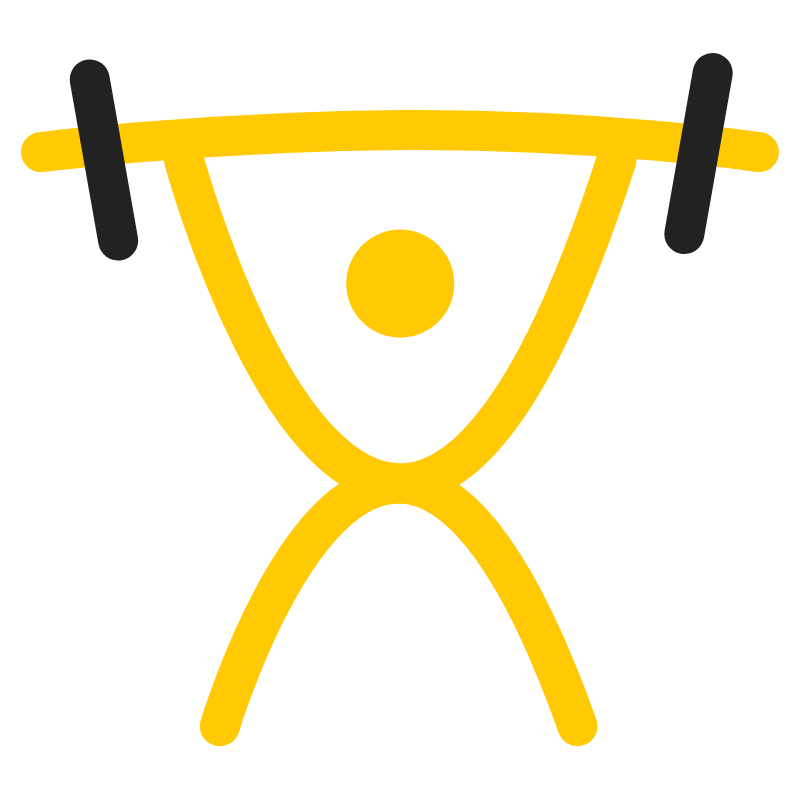

![Laravel-shield][Laravel-shield]
![Voyager-shield][Voyager-shield]
![Stage][Stage]
[![Contributors][contributors-shield]][contributors-url]
[![Forks][forks-shield]][forks-url]
[![Stargazers][stars-shield]][stars-url]
[![Issues][issues-shield]][issues-url]
[![MIT License][license-shield]][license-url]

<link rel="shortcut icon" href="http://www.iconj.com/ico/0/j/0jfxz36x0g.ico" type="image/x-icon" />

<!-- PROJECT LOGO -->
 

  

  <h3 align="center">Motion Gym</h3>

  

A open source gym management system build.
     
    <a href="https://cristianmarint.github.io/MotionGym/"><strong>Explore the docs »</strong></a>
     
     
    ·
    <a href="https://github.com/cristianmarint/MotionGym/issues">Report Bug</a>
    ·
    <a href="https://github.com/cristianmarint/MotionGym/issues">Request Feature</a>
  

<!-- TABLE OF CONTENTS -->
## Table of Contents

* [About the Project](#about-the-project)
  * [Built With](#built-with)
* [Getting Started](#getting-started)
  * [Prerequisites](#prerequisites)
  * [Installation](#installation)
* [Usage](#usage)
* [Roadmap](#roadmap)
* [Contributing](#contributing)
* [License](#license)
* [Contact](#contact)
* [Acknowledgements](#acknowledgements)

<!-- ABOUT THE PROJECT -->
### Installation

1. Clone the repo
`git clone https://github.com/cristianmarint/MotionGym.git`

2. Configure .env file
`mv .env.example .env`

3. Install composer
`composer install`

4.  Migrate database
`php artisan migrate`

5.  App key
`php artisan key:generate`

6. Seed database
`php artisan db:seed`

7. Create your own admin user
`php artisan voyager:admin your_email@provider.com --create `
or use 
> cristianmarint@motion.gym 12345678

8. Once your login, click on "Fix Missing storage symlink" an then
`php artisan storage:link`
`mv public\storage_old\* public\storage`

8.1 Delete storage_old
`rmdir .\public\storage_old\`

<!-- USAGE EXAMPLES -->
## Usage

Currently there are no useful example due to early stages.

<!-- ROADMAP -->
## Roadmap
See the [open issues](https://github.com/cristianmarint/MotionGym/issues) for a list of proposed features (and known issues).

<!-- CONTRIBUTING -->
## Contributing

Contributions are what make the open source community such an amazing place to be learn, inspire, and create. Any contributions you make are **greatly appreciated**.

1. Fork the Project
2. Create your Feature Branch (`git checkout -b feature/AmazingFeature`)
3. Commit your Changes (`git commit -m 'Add some AmazingFeature'`)
4. Push to the Branch (`git push origin feature/AmazingFeature`)
5. Open a Pull Request

<!-- LICENSE -->
## License

Distributed under the MIT License. See `LICENSE` for more information.

<!-- CONTACT -->
## Contact

Cristian Marin - [@cristianmarint](https://twitter.com/cristianmarint) - cristianmarint@cotecnova.edu.co
